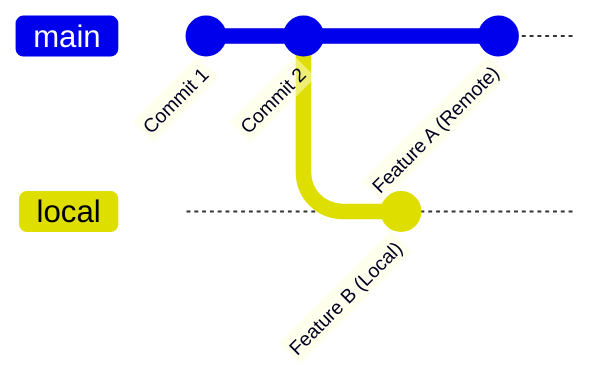

When using Git, you may encounter a situation where you’ve already run `git fetch`, but you don’t see the latest commits from the remote main branch. When you attempt to run `git pull`, you might see the following message:

```bash
hint: You have divergent branches and need to specify how to reconcile them.
hint: You can do so by running one of the following commands sometime before
hint: your next pull:
hint:   git config pull.rebase false  # merge
hint:   git config pull.rebase true   # rebase
hint:   git config pull.ff only       # fast-forward only
```

This is known as a **divergent branch** situation. It means that the latest commit on your local branch is different from the latest commit on the remote branch. This is a very common scenario in day-to-day development. For example:

1. Developer A pulls the remote `main` branch to their local machine.
2. Developer B also pulls the remote `main` branch.
3. Developer A commits `featureA` and pushes it to the remote repository.
4. Developer B commits `featureB` locally but hasn’t pushed it yet.
5. At this point, when Developer B tries to `git pull`, Git shows the "divergent branches" warning.



A **fast-forward** pull is only possible when your local branch has no unique commits that are not in the remote branch. However, in this situation, your local branch already has new commits. Git needs you to specify how you want to reconcile these changes.

## Solution: Three Pull Strategies

There are three strategies you can choose to resolve this situation:

### 1. Merge

This strategy creates a new **merge commit** that combines the remote changes with your local changes. Some developers consider merge commits to clutter the commit history, but it can be useful for preserving the context of how branches were integrated.

```bash
git pull --no-rebase
```

To set this as the default behavior:

```bash
git config pull.rebase false
```

### 2. Rebase

Rebasing applies your local commits on top of the latest commit from the remote branch. This avoids creating a merge commit, resulting in a cleaner, linear commit history.

```bash
git pull --rebase
```

To make this your default pull strategy:

```bash
git config pull.rebase true
```

### 3. Fast-Forward Only

This strategy only allows pulls when a fast-forward merge is possible. If your local branch has any commits that are not on the remote, Git will refuse to pull. This strategy guarantees a clean and safe commit history, but pull might fail if your local branch has any commits that are not yet pushed.

```bash
git pull --ff-only
```

To set this as the default:

```bash
git config pull.ff only
```

